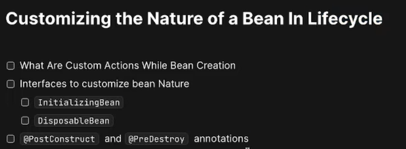

# Spring Boot Tutorial

Each branch corresponds to a specific tutorial from the respective YouTube channel.

## CodeSnippet
- **Branch**: `CodeSnippet`
- **YouTube Playlist**: [Spring Boot Videos](https://www.youtube.com/playlist?list=PL-bgVzzRdaPhNeXyQBtp8hMlUc14J2kRK)
- **Video Link**: [Customizing Bean Nature in Spring | Bean Lifecycle, @PostConstruct & @PreDestroy Explained](https://www.youtube.com/watch?v=KxWh70Xr35c&list=PL-bgVzzRdaPhNeXyQBtp8hMlUc14J2kRK&index=11)

## Agenda

