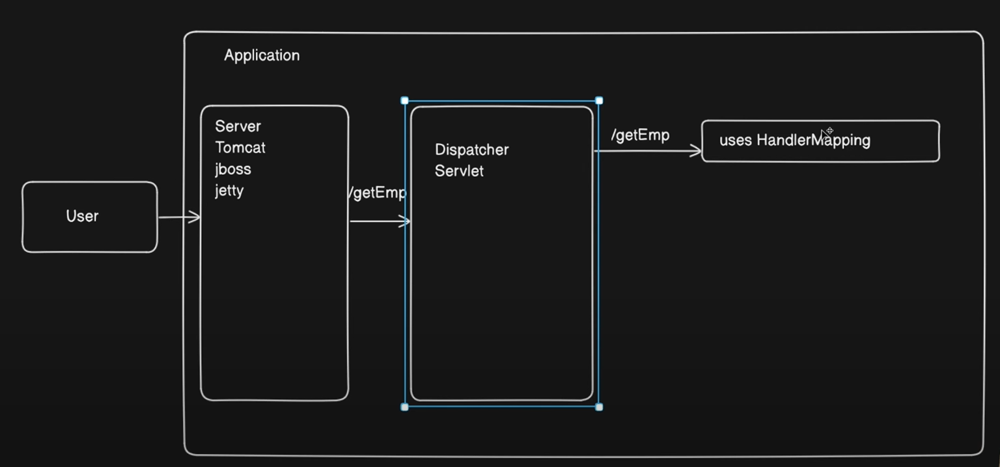

# Spring Boot Tutorial

Each branch corresponds to a specific tutorial from the respective YouTube channel.

## CodeSnippet
- **Branch**: `CodeSnippet`
- **YouTube Playlist**: [Spring Boot Videos](https://www.youtube.com/playlist?list=PL-bgVzzRdaPhNeXyQBtp8hMlUc14J2kRK)

### Video Tutorial
1. [Understanding Layered Architecture in Spring Boot | Best Practices and Implementation](https://www.youtube.com/watch?v=Kzrm-BdLckE&list=PL-bgVzzRdaPhNeXyQBtp8hMlUc14J2kRK&index=3)
2. [Spring Annotations Explained: Comprehensive Guide with Examples](https://www.youtube.com/watch?v=X3__pmlEJD0&list=PL-bgVzzRdaPhNeXyQBtp8hMlUc14J2kRK&index=4&t=1s)
3. [Understanding Beans and ApplicationContext in Spring Framework](https://www.youtube.com/watch?v=DQbkePm2ims&list=PL-bgVzzRdaPhNeXyQBtp8hMlUc14J2kRK&index=7)

## Images
### API Flow - Video #2
