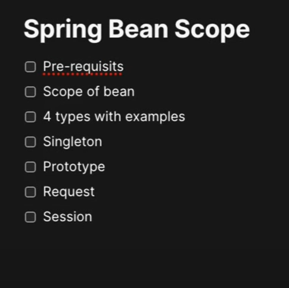

# Spring Boot Tutorial

Each branch corresponds to a specific tutorial from the respective YouTube channel.

## CodeSnippet
- **Branch**: `CodeSnippet`
- **YouTube Playlist**: [Spring Boot Videos](https://www.youtube.com/playlist?list=PL-bgVzzRdaPhNeXyQBtp8hMlUc14J2kRK)
- **Video Link**: [Deep Dive into Spring Bean Scopes: Types and Uses Explained](https://www.youtube.com/watch?v=Pjo50v0yWZ0&list=PL-bgVzzRdaPhNeXyQBtp8hMlUc14J2kRK&index=13)

## Agenda

